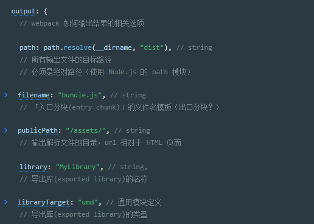
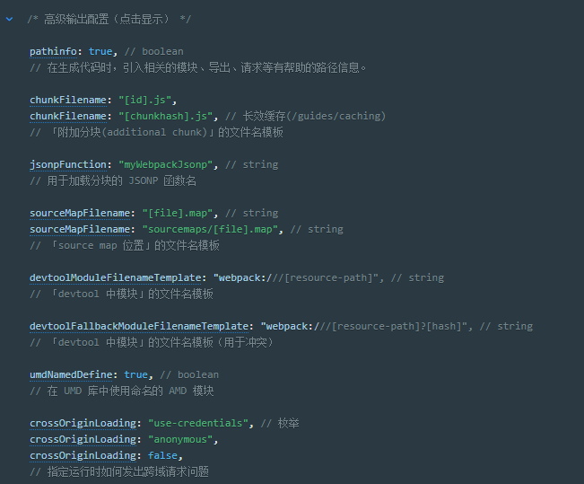
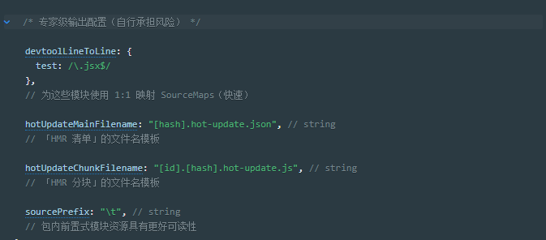

# 配置

webpack的配置文件，是到处一个对象的JavaScript文件

webpack配置是标准的Node.js CommonJS模块：

- 通过`require(...)`方式导入其他文件
- 通过`reqiure(...)`使用npm的工具函数
- 使用JavaScript控制表达式，例如`?:`操作符
- 对常用值使用常量或变量
- 编写并执行函数来生成部分配置

**避免如下操作：**

- 在使用webpack命令行接口（CLI）（应该编写自己的命令行接口，或使用）时，访问命令行接口（CLI）参数
- 导出不确定的值（调用webpack两次应该产生同样的输出文件）
- 编写很长的配置（应该将配置拆分为多个文件）

## 一、基本配置

**webpack.config.js**

```javascript
var path = require('path');

module.exports = {
  mode: 'development',   // 开发环境
  entry: './foo.js',  // 入口文件
  output: {     // 出口
    path: path.resolve(__dirname, 'dist'),
    filename: 'foo.bundle.js'
  }
};
```

*注意整个配置中使用 Node 内置的* [path 模块](https://nodejs.org/api/path.html)*，并在它前面加上* [__dirname](https://nodejs.org/docs/latest/api/globals.html#globals_dirname)*这个全局变量。可以防止不同操作系统之间的文件路径问题，并且可以使相对路径按照预期工作。*

详情参考：[path模块](https://nodejs.org/api/path.html#path_windows_vs_posix)

### 1、配置选项

详细内容参考：[选项]([https://www.webpackjs.com/configuration/#%E9%80%89%E9%A1%B9](https://www.webpackjs.com/configuration/#选项))

### 2、配置选项解析

对配置项中的各个模块的功能和用法的解析

#### 2.1 入口和上下文（entry and context）

entry对象是用于webpack查找启动并构建bundle。其上下文是入口文件所处的目录的绝对路径的字符串

##### `context`

数据类型：`string`

基础目录，**绝对目录**，webpack 的主目录，entry和module.rules.loader选项相对于此目录进行解析

##### `entry`

数据类型：`string | [string] | object { <key>: string | [string] } | (function: () => string | [string] | object { <key>: string | [string] })`

应用程序的起点入口，webpack从这个入口开始进行打包。

入口可以是一个也可以是多个，具体参考：[入口起点](https://www.webpackjs.com/concepts/entry-points/)

动态加载的模块**不是**入口起点。

### 命名

如果传入一个字符串或字符串数组，chunk 会被命名为 `main`。如果传入一个对象，则每个键(key)会是 chunk 的名称，该值描述了 chunk 的入口起点。

### 动态入口

```js
entry: () => './demo'
```

或

```js
entry: () => new Promise((resolve) => resolve(['./demo', './demo2']))
```

当结合 [`output.library`](https://www.webpackjs.com/configuration/output#output-library) 选项时：如果传入数组，则只导出最后一项。

#### 2.2 输出（output）

`output` 位于对象最顶级键(key)，包括了一组选项，指示 webpack 如何去输出、以及在哪里输出你的「bundle、asset 和其他你所打包或使用 webpack 载入的任何内容」。

基础的`output`配置：



高级配置项：



专家级配置项：



## 二、使用不同语言进行配置

webpack接受以多种编程和数据语言编写的配置文件。支持文件的拓展名可在 [node-interpret](https://github.com/js-cli/js-interpret) 中查找

### 1、TypeScript

用TypeScript编写webpack配置文件

安装依赖

```bash
npm install --save-dev typescript ts-node @types/node @types/webpack
```

**如果要TS进行webpack配置编写，需要webpack版本在2.7及以上，或者在`tsconfig.json`中包含`esModuleInterop`和`allowSyntheticDefaultImports`这两个新的编译器选项的较新版本的TypeScript**

**同时还需要核对`tsconfig.json`中的`compilerOptions`的module字段是否为`commonjs`如果是则配置正确，如果不是将会构建失败，是因为`ts-node`不支持`commonjs`以外的任何模块语法**

针对上面的问题有两种解决方案：

- 修改`tsconfig.json`文件,打开`tsconfig.json`文件查找`compilerOptions`将`target`设置为`ES5`,同时将`module`设置为`CommonJs`（或者移除module选项）。
- 安装`tsconfig-path`

```bash
npm install --save-dev tsconfig-paths
```

然后为webpack创建一个单独的TypeSCript配置：

**tsconfig-for-webpack-config.json**

```json
{
  "compilerOptions": {
    "module": "commonjs",
    "target": "es5"
  }
}
```

然后设置`tsconfig-path`提供的环境变量`process.env.TS_NODE_PROJECT`:

**package.json**

```json
{
  "scripts": {
    "build": "TS_NODE_PROJECT=\"tsconfig-for-webpack-config.json\" webpack"
  }
}
```

### 2、CoffeeScript

安装依赖：

```bash
npm install --save-dev coffee-script
```

**webpack.config.coffee**

```javascript
HtmlWebpackPlugin = require('html-webpack-plugin')
webpack = require('webpack')
path = require('path')

config =
  mode: 'production'
  entry: './path/to/my/entry/file.js'
  output:
    path: path.resolve(__dirname, 'dist')
    filename: 'my-first-webpack.bundle.js'
  module: rules: [ {
    test: /\.(js|jsx)$/
    use: 'babel-loader'
  } ]
  plugins: [
    new (webpack.optimize.UglifyJsPlugin)
    new HtmlWebpackPlugin(template: './src/index.html')
  ]

module.exports = config
```

### 3、Babel and JSX（React形式的JS）

安装依赖：

```js
npm install --save-dev babel-register jsxobj babel-preset-es2015
```

**.babelrc**

```json
{
  "presets": [ "es2015" ]
}
```

**webpack.config.babel.js**（官网范例）

```js
import jsxobj from 'jsxobj';

// example of an imported plugin
const CustomPlugin = config => ({
  ...config,
  name: 'custom-plugin'
});

export default (
  <webpack target="web" watch mode="production">
    <entry path="src/index.js" />
    <resolve>
      <alias {...{
        react: 'preact-compat',
        'react-dom': 'preact-compat'
      }} />
    </resolve>
    <plugins>
      <uglify-js opts={{
        compression: true,
        mangle: false
      }} />
      <CustomPlugin foo="bar" />
    </plugins>
  </webpack>
);
```

*如果你在其他地方也使用了 Babel 并且把*`模块(modules)`*设置为了* `false`*，那么你要么同时维护两份单独的* `.babelrc` *文件，要么使用* `conts jsxobj = requrie('jsxobj');` *并且使用* `moduel.exports` *而不是新版本的* `import` *和* `export` *语法。这是因为尽管 Node.js 已经支持了许多 ES6 的新特性，然而还无法支持 ES6 模块语法。*

## 三、多种配置类型

除了导出单个配置对象，还有一些方式满足其他需求。

#### 1、导出为一个函数

环境对象(environment)作为第一个参数。有关语法示例，请查看[CLI 文档的环境选项](https://www.webpackjs.com/api/cli#environment-options)。 一个选项 map 对象（`argv`）作为第二个参数。这个对象描述了传递给 webpack 的选项，并且具有 [`output-filename`](https://www.webpackjs.com/api/cli/#output-options) 和 [`optimize-minimize`](https://www.webpackjs.com/api/cli/#optimize-options) 等 key。

```diff
-module.exports = {
+module.exports = function(env, argv) {
+  return {
+    mode: env.production ? 'production' : 'development',
+    devtool: env.production ? 'source-maps' : 'eval',
     plugins: [
       new webpack.optimize.UglifyJsPlugin({
+        compress: argv['optimize-minimize'] // 只有传入 -p 或 --optimize-minimize
       })
     ]
+  };
};
```

#### 2、导出一个Promise

webpack 将运行由配置文件导出的函数，并且等待 Promise 返回。便于需要异步地加载所需的配置变量。

```js
module.exports = () => {
  return new Promise((resolve, reject) => {
    setTimeout(() => {
      resolve({
        entry: './app.js',
        /* ... */
      })
    }, 5000)
  })
}
```

#### 3、导出多个配置对象

从 webpack 3.1.0 开始支持导出多个函数，当运行 webpack 时，所有的配置对象都会构建。

```js
module.exports = [{
  output: {
    filename: './dist-amd.js',
    libraryTarget: 'amd'
  },
  entry: './app.js',
  mode: 'production',
}, {
  output: {
    filename: './dist-commonjs.js',
    libraryTarget: 'commonjs'
  },
  entry: './app.js',
  mode: 'production',
}]
```
